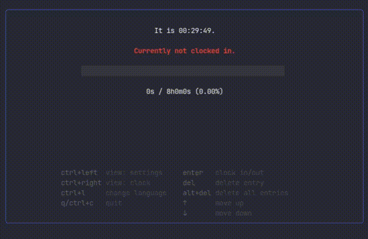

# gowt - **Go** **W**ork **T**imer

A small terminal application to track your daily work time because I wanted to build a TUI. Made with [Bubbletea](https://github.com/charmbracelet/bubbletea).

## Installation

### Download

You can download the most recent version of gowt from the [releases page](https://github.com/simon-kolkmann/gowt/releases).
